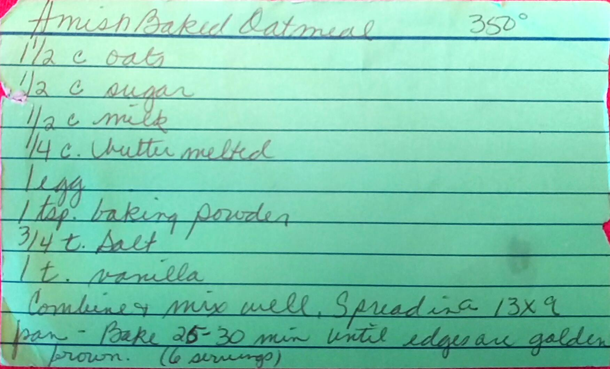

Amish Baked Oatmeal
======================================================

!!! note
Makes about 6 servings

Ingredients
-------------------------------------------------------
* 1 1/2 c oats
* 1/2 c. sugar
* 1/2 c. milk
* 1/4 c. melted butter
* 1 egg
* 1 tsp. baking powder
* 3/4 tsp. salt
* 1 tsp. vanilla

Directions
------------------------------------------------------
1. Combine all Ingredients and mix well
2. Spread in a 13x9 pan
3. Bake at 350 until the edges are golden brown, about for 25-30 mins

Pictures
-----------------------------------------------------

