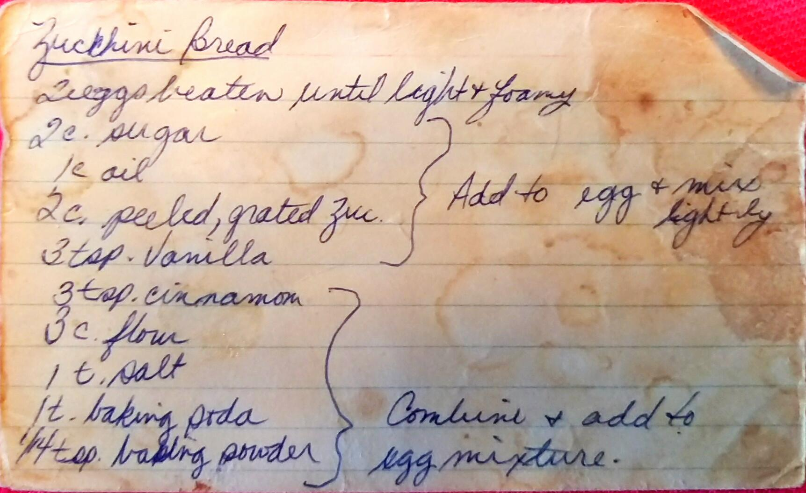
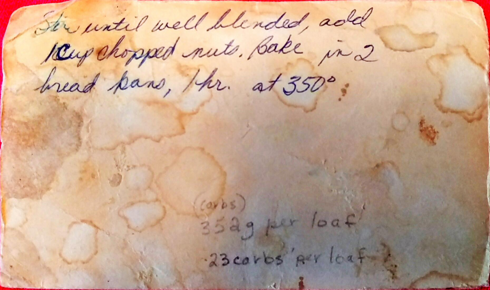

Zucchini Bread
========================================================

Ingredient
----------------------------------------------------------
* 2 Eggs
* 2 c. Sugar
* 1 c. Oil
* 2 c. peeled, grated zucchini
* 3 tsp. Vanilla
* 3 tsp. Cinnamon
* 3 c. Flour
* 1 tsp. Salt
* 1 tsp. Baking Soda
* 1/4 tsp. Baking Powered
* 1 c. chopped nuts. *(Optional)*

Directions
------------------------------------
1. Beat eggs until light anf foamy
2. Add sugar, oil, Zucchini, and vanilla to eggs and mix lightly
3. Combine cinnamon, flour, salt, baking soda, baking powder and add to egg mixture
4. Stir until well blended
5. Add chopped nuts
6. Bake in 2 bread pans for an hour at 350°

Nutritional Information
----------------------------------------------
* 352 grams per loaf
* 23 carbs per loaf

Pictures
-------------------------------------------------

Notes:
--------------------------------
* Usually made at breakfast
* Good toasted with butter :)
