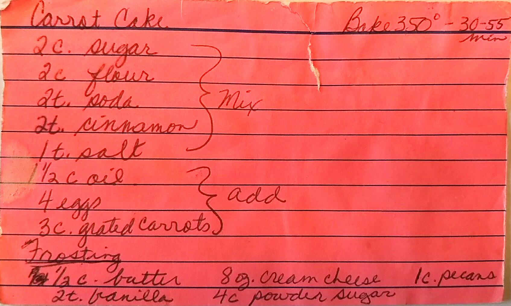

Carrot Cake
==========================================================

_One cake :)_

Ingredients (Cake)
--------------------------------------------
* 2 cup Sugar
* 2 cup Flour
* 2 tsp. baking soda
* 2 tsp. cinnamon
* 1 tsp. salt
* 1 1/2 cup oil
* 4 eggs
* 3 cups grated carrots

Ingredients (Cream Cheese Frosting)
--------------------------------------------
* 1/2 cups butter
* 8 oz. Cream Cheese
* 1 cup peacons
* 2 tsp. vanilla
* 4 cup powder sugar

Directions (cake)
--------------------------------------------
1. Mix sugar, flour, baking soda, cinnamon, and salt
2. Add oil, eggs, and carrots
3. Bake 350 for 30-55 mins

Directions (Frosting)
--------------------------------------------
1. Mix together ingedients and chill

Pictures
----------------------------------------------------

