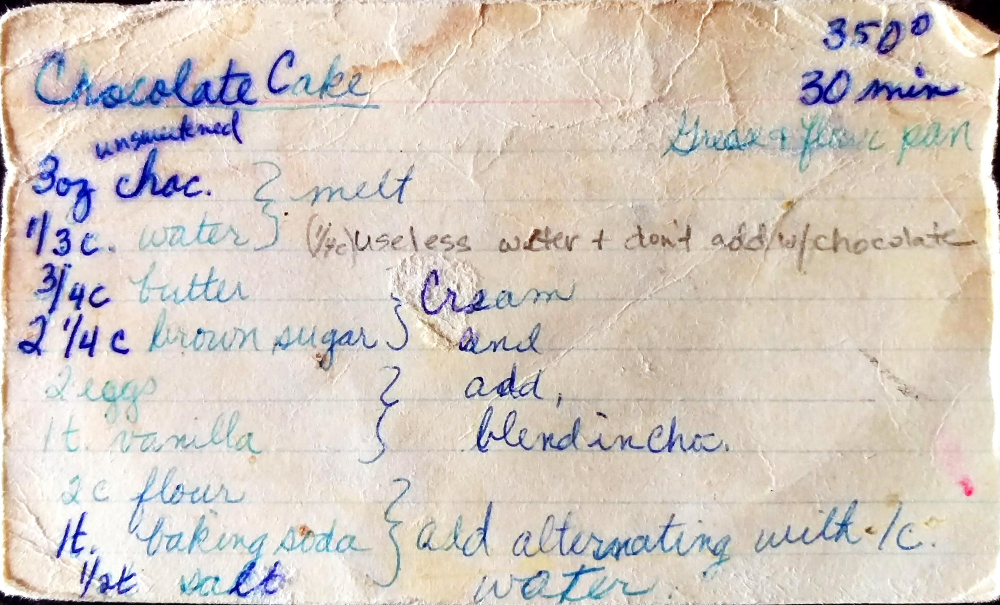

Chocolate Cake
==========================================================

_One cake :)_

Ingredients
--------------------------------------------
* 3 oz. unsweetened chocolate 
* 1/4 cup water
* 3/4 cup butter
* 2 1/4 brown sugar
* 2 eggs
* 1 tsp. vanilla
* 2 cup flour
* 1 tsp. flour
* 1/2 tsp. salt

Directions
--------------------------------------------
1. Grease and flour pan
2. Melt chocolate (maybe with water?, see picture) 
3. Cream butter and brown sugar
4. Add 2 eggs
5. Blend in chocolate
6. Mix flour, baking soda, and salt. Add to egg mixture, alternating with 1 cup of water. 

Pictures
----------------------------------------------------

Notes
---------------------------------------------------------
* Liz Livecchi has slow modified it over time
* This is the traditional birthday cake recipes
