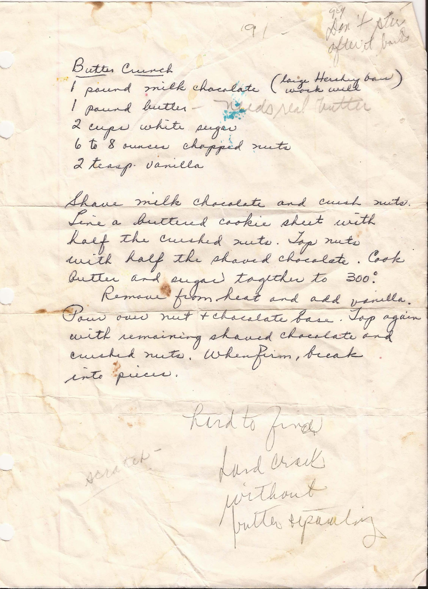

Butter Crunch (Easter Candy)
============================================
_Makes 1 cookie sheet_

Ideas
------------------------------------------------
* Put the nuts inside the caramel
* Use a better Chocolate
* Use less chocolate, maybe only one side

Ingredient
----------------------------------------------------------
* 1 lbs. Hershey Chocolate
* 1 lbs. butter
* 2 cups white sugar
* 6-8 oz. chopped nuts
* 2 teaspoons of vanilla

Directions
------------------------------------------
1. Shave chocolate or use food processor.
  * Should be small chunk or flake that will melt easily
  * Helps is chocolate is frozen before hand
2. Chop nuts
3. Line a buttered cookie sheet with half the nuts followed by half the chocolate
  * Best to have this stage done before continuing
4. Cook & stir butter and sugar together until it reaches 300°F (hard crack).
  * Hard crack: Caramel dripped into cold water should hard.
  * Don't swipe the butter on the edge of the pot above the caramel as it cooks. _This was suggested by Jean Smerklo, but Liz Livecchi doesn't worry about it._
5. Remove from heat and add vanilla
6. Quickly pour over the nut & chocolate base
7. Top with remaining chocolate and then nuts. (The chocolate should melt)
8. Refrigerate till hardened. Break into pieces and enjoy!

Pictures
-----------------------------------------------

Notes
---------------------------------------------------------
* Originally from Jean Smerklo
* Easter Candy Recipe
