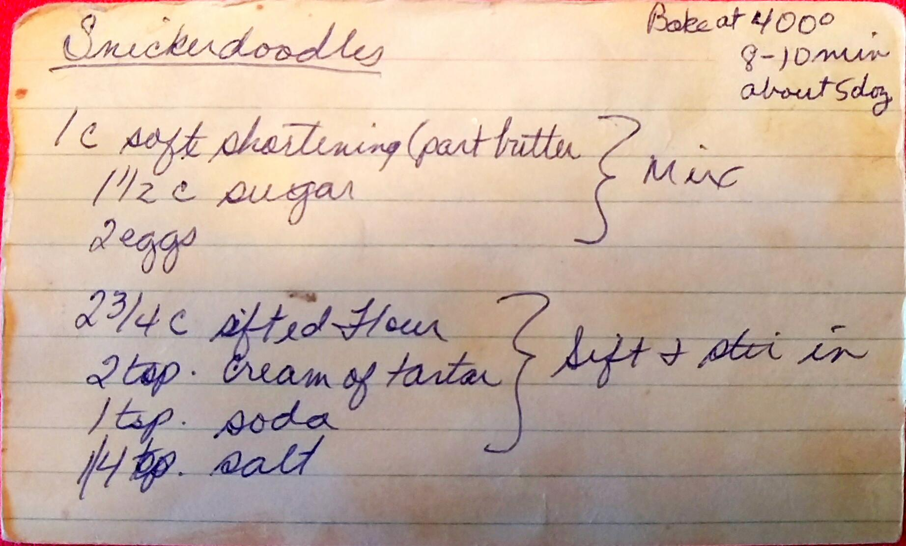
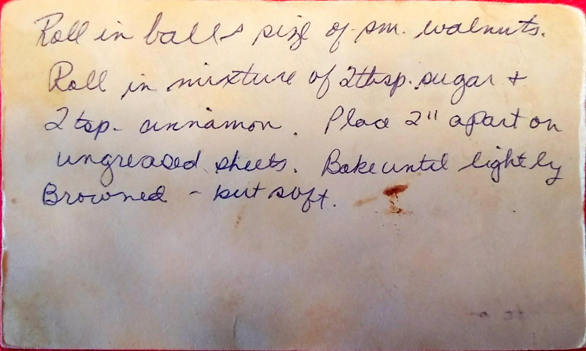

Snicker Doodles
==========================================

!!! note
About 5 dozen cookies

Ingredients
-----------------------------------------------
* 1/2 c. Crisco
* 1/2 c. butter
* 1 1/2 c. sugar
* 2 Eggs
* 2 3/4 c. shifted flour
* 2 tsp. cream of tartar
* 1 tsp. baking soda
* 1/4 tsp. salt
* Cinnamon Sugar for coating
  - 2 tbsp. sugar
  - 2 tsp. cinnamon

Directions
-------------------------------------------------
1. Mix Crisco, butter, sugar and egg together.
2. Sift dry ingredients together and stir in
3. Roll into balls the size of small walnuts
4. Roll balls in cinnamon sugar and place 2 inches apart on ungreased cookie sheet
5. Bake at 400 until lightly browned but soft, about 8-10 mins

Pictures
--------------------------------------------------

