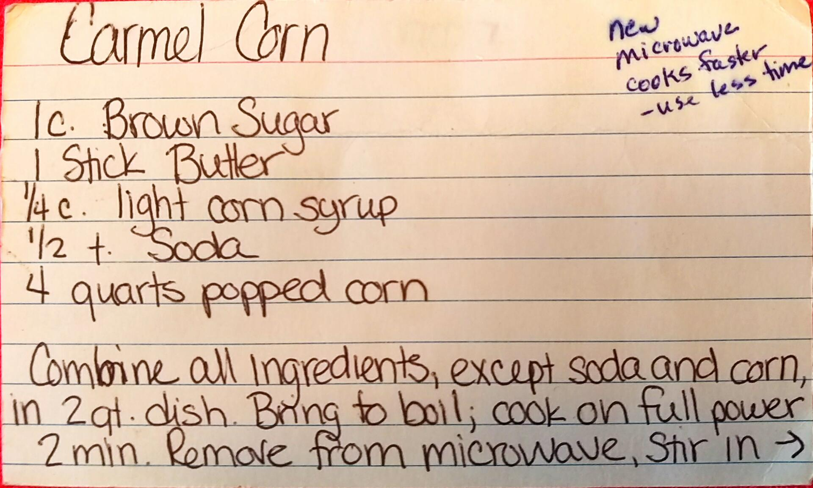
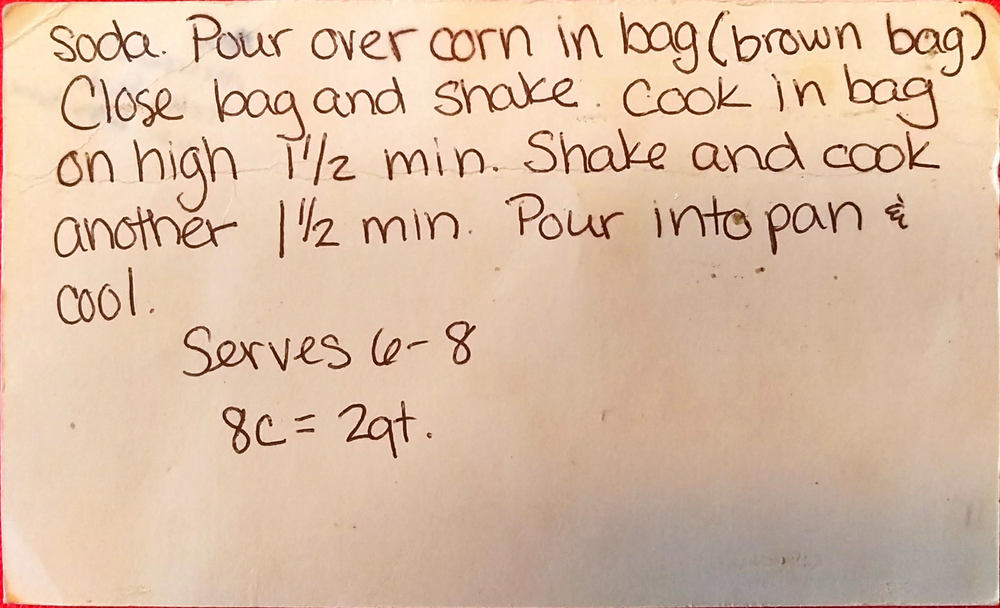

Caramel Corn
========================================================
*Makes 2 quarts*

Ingredient
----------------------------------------------------------
* 1 c. Brown Sugar
* Stick Butter
* 1/4 c. light corn syrup
* 1/2 tsp. Baking Soda
* $ quarts popped corn

Directions
------------------------------------
1. Combine all ingredients, except soda and corn in 2 qt. dish
2. Bring to boil, cook on full power for 2 mins.
3. Remove from microwave, stir in soda
4. Pour over corn in brown bag
5. Close bag and shake
6. Cook in bag on high 1.5 minutes
7. Shake nad cook another 1.5 minutes
8. Pour onto cookie sheet and cool

Pictures
-------------------------------------------------

