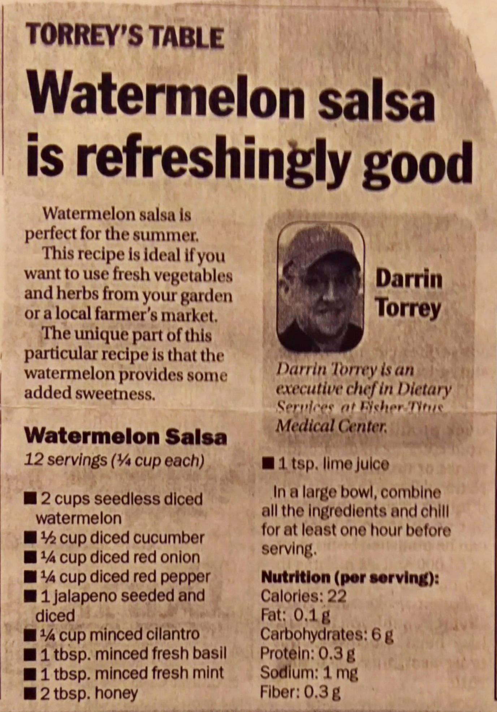

Watermelon Salsa
============================================

Ingredients
--------------------------------------------
* 2 c. diced seedless watermelon
* 1/2 c. diced cucumber
* 1/4 c. diced red onion
* 1/4 c. diced red pepper
* 1 jalapeno, seeded and diced
* 1/4 c. minced cilantro
* 1 tbsp. minced fresh basil
* 1 tbsp. minced fresh mint
* 2 tbsp. honey
* 1 tsp. lime juice
* tortillas chips

Directions
---------------------------------------------
1. In large bowl, combine all ingredients
2. Chill for at least an hour

Pictures
---------------------------------------------

Notes
----------------------------------------------
* From Father Mark Herzog
