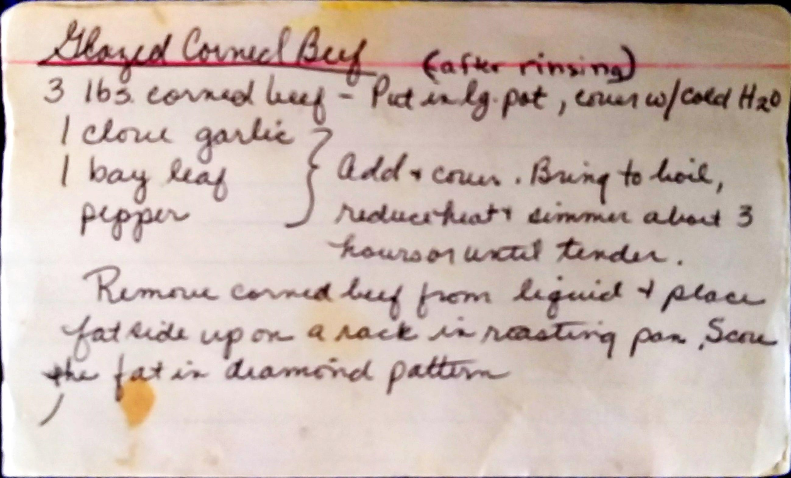
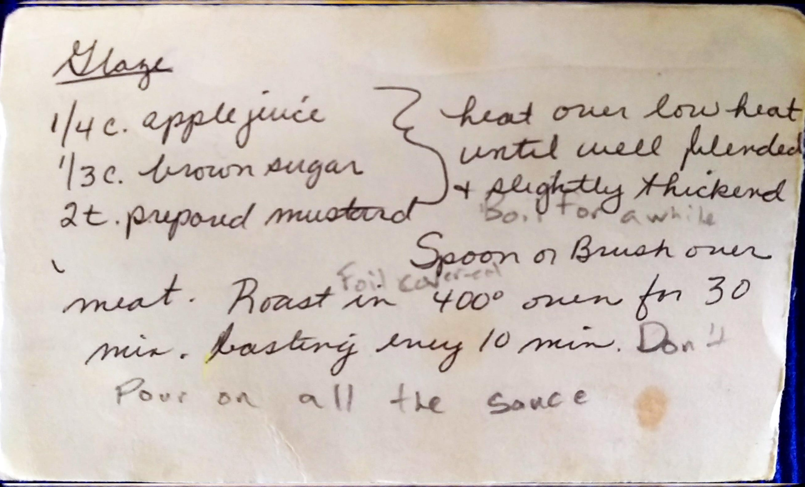

Corned Beef
=====================================================

Ingredients
------------------------------------------
### Beef
* 3 lbs. corned Beef
* 1 clove garlic
* bay leaf
* pepper

### Sauce
* 1/4 c. apple juice
* 1/3 c. brown sugar
* 2 tsp. prepared mustard

Directions
--------------------------------------------------
1. Rinse the Beef
2. Put in large pot, cover with cold water
3. Add spices, cover the pot and bring to boil.
  * Reduce the heat and simmer about 3 hours until tender
  * This can also be done in crock pot
4. Remove beef from liquid and place fat side up on a rack in roasting pan
5. Score the fat in diamond pattern
6. **Sauce:** Heat ingredients over low heat until well blended and slightly thickened
  * Cook over low heat for a while
7. Spoon (or brush) the sauce over the beef.
  * Don't use all of the sauce, just enough to cover the beef.
8. Roast at 400°F over for 30 minutes
  * Baste the meat with every 10 minutes

Pictures
-------------------------------------------------

Notes
---------------------------------------------------------
* Original Author: Ann Smerklo
* St. Patrick's Day
