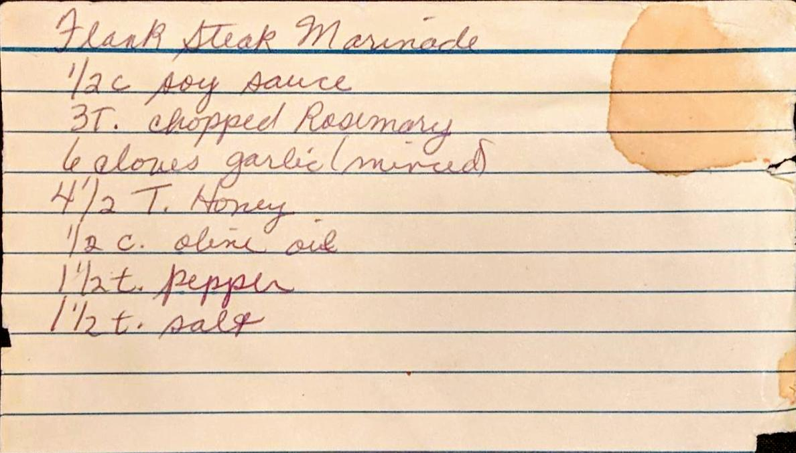

Flank Steak Marinade
======================================================

Ingredients
------------------------------------------------------

* 1/2 c. Soy Sauce
* 3 Tbsp. Fresh Choppped Rosemary (3 tsp. dried)
* 6 Cloves Garlic, minced
* 4 1/2 Tbsp. Honey
* 1/2 c. Olive Oil
* 1 1/2 tsp. pepper
* 1 1/2 tsp. salt

Directions
------------------------------------------------------

1. Mix all the ingedinets
1. If needed, add water to cover meat.

Pictures
-----------------------------------------------------

