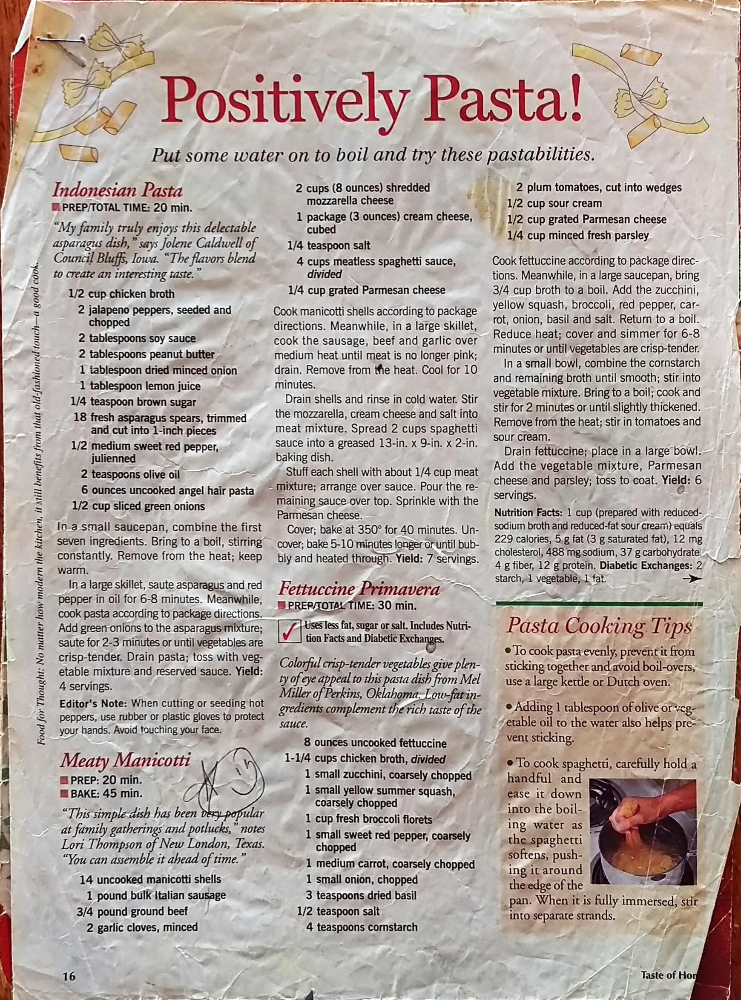

Meaty Manicotti
==========================================================

_Makes about one box of manicotti tubes or large jumbp shells_

Ingredients
--------------------------------------------

* 1 box manicotti shells
* 1 lb italian sausage (links or ground)
* 1 lb ground beef
* 2 cloves minced garlic
* 2+ cups shredded mozzarella
* 3-8 oz cream cheese 
* 1 tsp. salt
* 1 jar spaghetti sauce
* Shredded mozzarella or grated parmesan cheese to top

Directions
--------------------------------------------

1. Cook manicotti or jumbo shells
2. Cook garlic, sausage and ground beef together. When cooked, drain fat
3. Mixed in cheese and salt into meat mixture (you might want to let it cool as to not burn yourself)
4. Pour sauce into backing dish to cover the bottom. Fill each tube/shell with meat mixture and place in pan. Cover with more sauce and cheese
5. Bake covered at 350º for 40 mins and then 5-10 more uncovered until bubbly and heated through 

Pictures
----------------------------------------------------

Notes
---------------------------------------------------------
* Tweaks by Joseph 