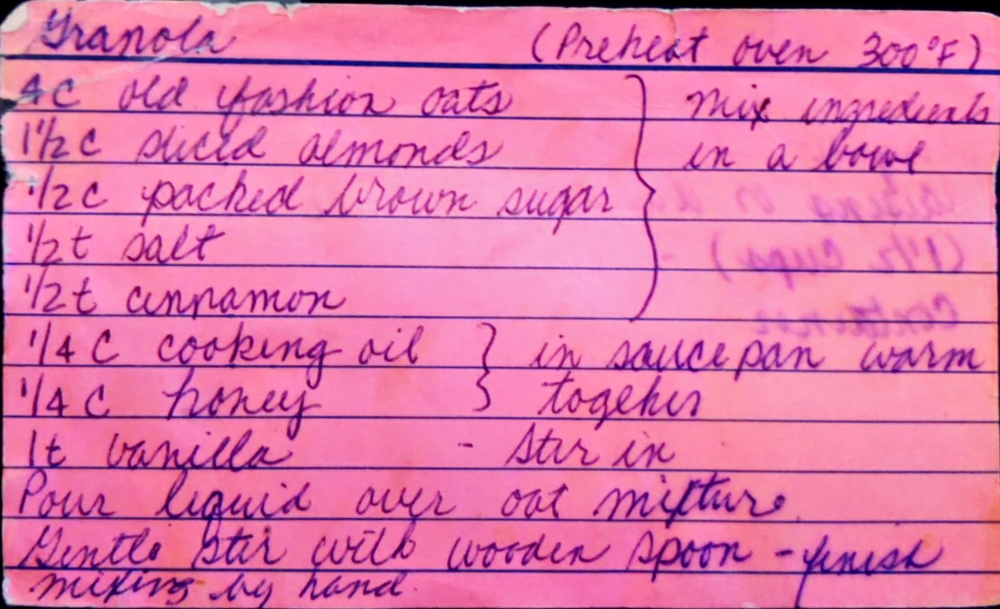
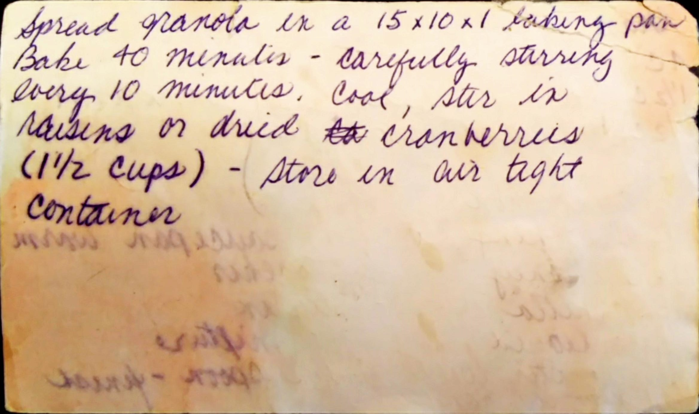

Granola
======================================================

Ingredients
-------------------------------------------------------

* 4 c. old fashion oats
* 1/2 c. sliced almonads
* 1/2 c. packed brown sugar
* 1/2 t. salt
* 1/2 t. cinnamon
* 1/4 c. cooking oil
* 1/4 c. honey
* 1 t. vanilla

Directions
------------------------------------------------------

1. Mix all the dry ingedinets in a bowl
2. In sauce pan, stir the honey and oli together until there are warm and htne mix in the vanilla
3. Poor liqiud into dry mixture and stir with wodden spoon until combined, it may be nessercary to finish mixing by hand
4. Spead on to bakins sheet (15x10x1) and bake at 300 for 40 minutes, stiring every 10 minutes.
5. Cool and store in air tight container

Pictures
-----------------------------------------------------

