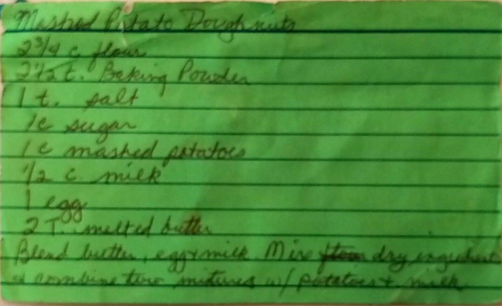
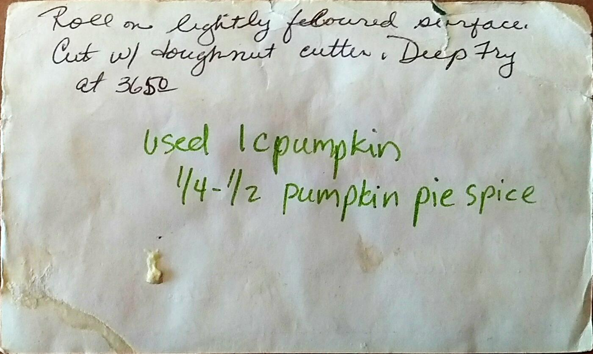

Mashed Potato Doughnuts
========================================================

Ingredient
----------------------------------------------------------
* 2 3/4 c. flour
* 2 1/2 t. Baking Powered
* 1 tsp. salt
* 1 cup sugar
* 1 cup mashed potatoes ( ~ 15 oz. can )
* 1/2 cup milk
* 1 egg
* 2 Tbsp. melted butter

Directions
------------------------------------
1. Blend butter, egg, & milk.
2. Mix dry ingredients. Combine with potatoes and milk mixture.
3. Stir for about 2 minutes
4. Roll on lightly floured surface and cutout.
5. Deep fry @ 350° F until browned.
6. *Optional - Coat with glaze*

Variations
---------------------------------
### Pumpkin
* 1 cup Pumpkin
* 1/4-1/2 tsp. Pumpkin Pie Spice

Pictures
-------------------------------------------------

Notes:
--------------------------------
* Made for breakfast
