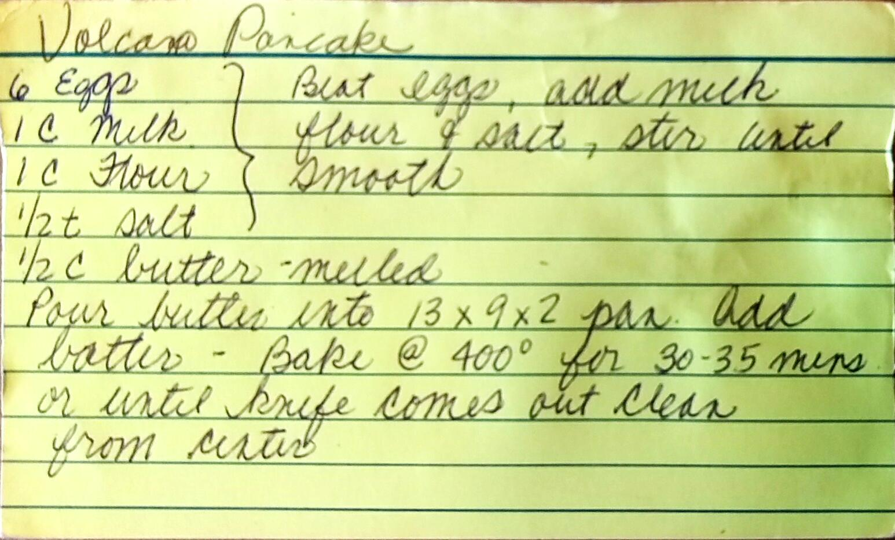

Volcano Pancake
========================================================

Ingredient
----------------------------------------------------------
* 6 eggs
* 1 cup milk
* 1 cup flour
* 1.2 tsp. salt
* 1/2 cup butter
* Powered Sugar

Directions
------------------------------------
1. Beat eggs.
2. Add milk.
3. Add flour and salt, stir until smooth.
4. Pour butter into a 13x9x2 pan. Add batter.
5. Bake @ 400 for 30-35 mins or until knife comes out clean from center.
6. Dust with power sugar.

Pictures
-------------------------------------------------

Notes:
--------------------------------
* Also known as a dutch baby
