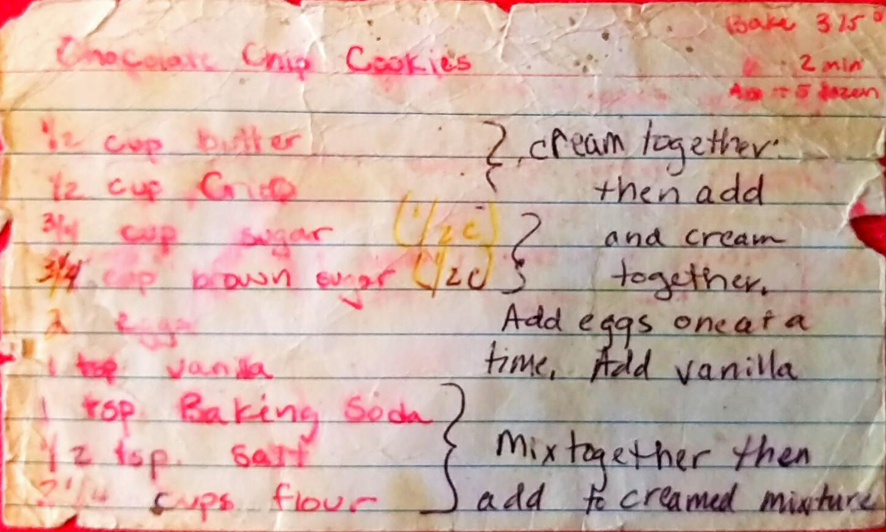
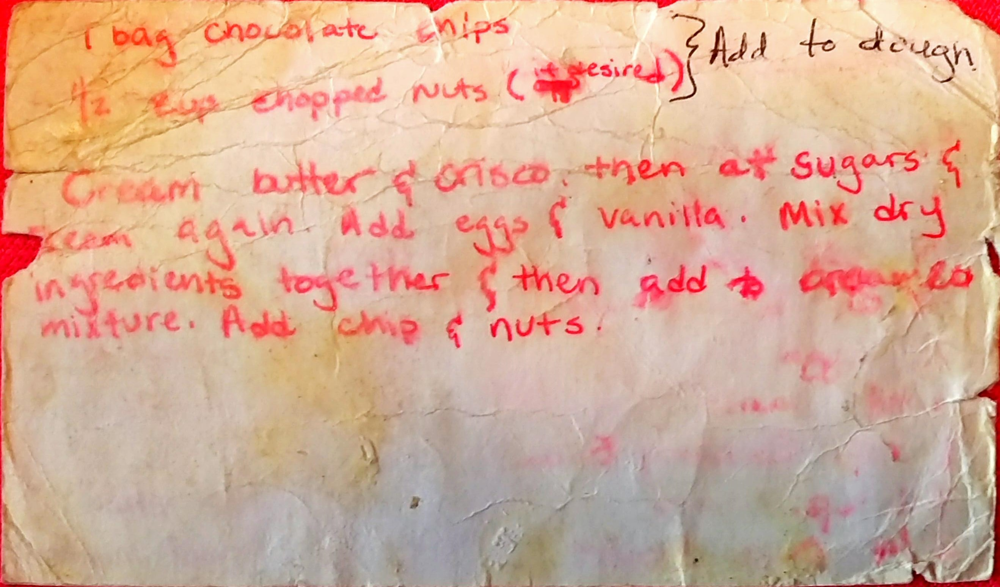

Chocolate Chip Cookies
========================================================
*Makes about 5 dozen*

Ingredient
----------------------------------------------------------
* 1/s c. butter
* 1/2 c. Crisco
* 1/2 c. Sugar
* 1/2 c. Brown Sugar
* 2 Eggs
* 1 tsp. Vanilla
* 1 tsp. Baking Soda
* 1/2 tsp. Salt
* 2 1/4 C. Flour 
* 1 Bag of Chocolate Chips
* 1/2 c. Chopped Nuts *(Optional)*

Directions
------------------------------------
1. Cream together butter and crisco
2. Add sugar and brown sugar and cream
3. Add eggs one at a time
4. Add Vanilla
5. Mix together baking soda, salt, and flour then add to cream mixture
6. Add chocolate chips and nuts
7. Bake 350° for 10-12 minutes

Pictures
-------------------------------------------------

