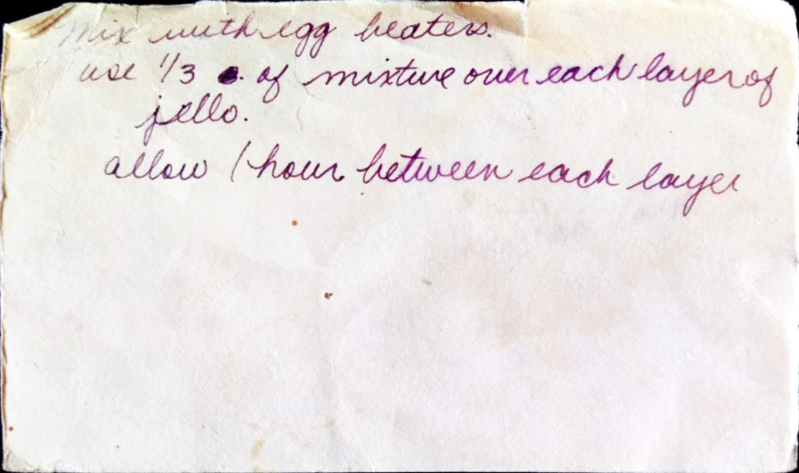

Ribbon Jello
==========================================

!!! note
Makes a 13xp pan

Ingredients
-----------------------------------------------
* 4 boxes Jello
* 2 c. Milk
* 1 c. sugar
* 2 packs Knox gelatin
* 1 pint sour cream
* 2 tsp. vanilla

Directions
-------------------------------------------------
1. Mix first box of Jello with 1 cup boiling water and add 1/2 cup cold water. Pour into pan and chill for about an hour
2. For white layer, boil milk and add 1 cup of sugar
3. Soften gelatin in  1/2 cup of warm water. Put in with milk.
4. Add sour cream, vanilla. (_not sure about the line with egg beaters_)
5. Use 1/3 cup of white mixture over each layer of Jello, chilling in between.

Pictures
--------------------------------------------------

