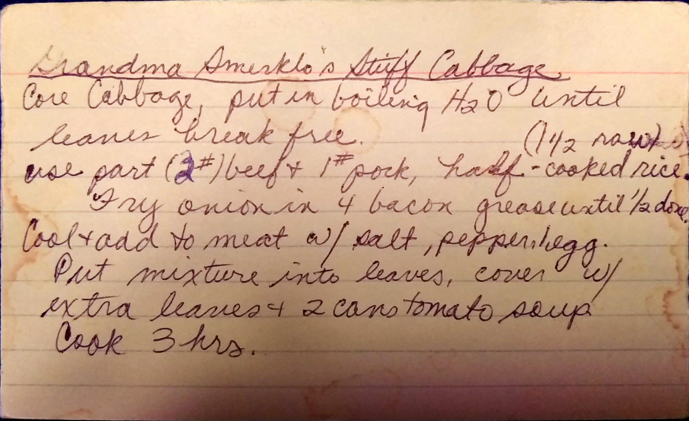

Stuffed Cabbage
==================================================================
*Approximately 40 rolls* - **Needs More Detail!**

Ingredients
----------------------------------------------------------
* 3 Heads of Cabbage
* 3 lbs. of beef
* 2 lbs. of pork
* 2 cups of uncooked rice
* eggs
* cans of tomato soup

Directions
---------------------------------------
### Beef Mixture
1. Cook rice.
  * Grandma Jean would cook with a bouillon cube. Then spread the rice out on a pan before adding to meat.
2. Mix the beef, pork, and rice
3. Add eggs until the mixture is able to hold its shape.

### Tomato Sauce
1. Make a rue with bacon grease mixing until thick.
2. Mix in chicken broth and salt and pepper to taste
3. Mix large can of diced tomatoes
5. Extra tomato rue can be put in bottom of pan topped with leftover cabbage leaves.

### Cabbage
1. Core Cabbage.
  * Cut a wide circle around the core
2. Boil the whole head until the leaves break free.
3. Cut off the vein of the cabbage leaf as soon as possible after pulling from the water.
  * Start at the mid point.
  * The leaf should be foldable.
  * Sometimes you may need to cut off the stem
  * You should burn your hand at least once. 😀
  * Tuck the cabbage in water to get veins softer

### Assembly
1. Fill cabbage leaves with 1/3 -  1/2 cup of meat mixture depending on leaf sized
2. Cover with extra leaves and 2 cans of tomato soup
3. Cook for 3 hours @ 300°.

Pictures
----------------------------------------------

Notes
-------------------------------------------------
* Originally from Grandma Smerklo
* Made around Easter
* This is the 2017 reversion
* Carol Swartz (Perlaky) uses uncooked onion and garlic. She uses 80% beef / 20% pork  mixture. Uses uncooked barley, slat and pepper.   
