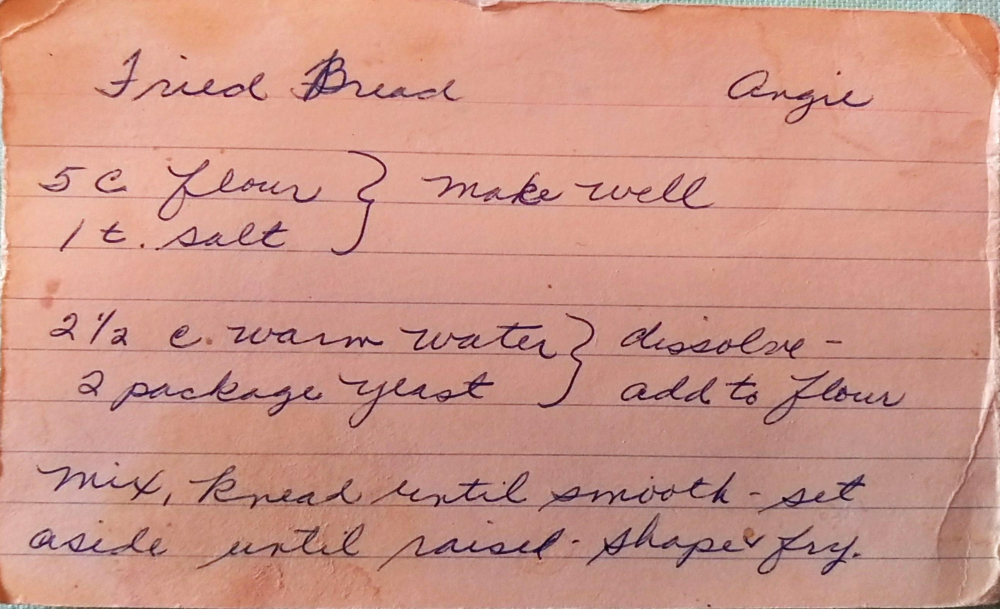
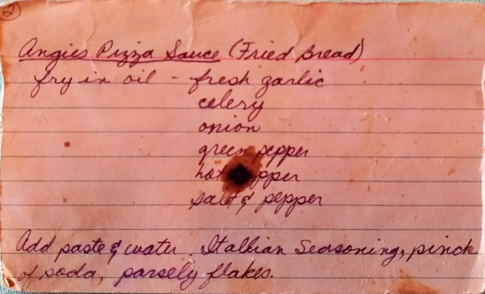

Fried Bread & Sauce
=====================================================

Ingredients
------------------------------------------
### Bread:

Large Batch          | Small Batch
---------------------|--------------------
5 lbs. flour         | 5 c. flour
4 c. warm water      | 2 c. warm water
fist full of salt    | 1 teaspoon salt
3 yeast              | 2 dry yeast
oil in warm water    | little oil in water

### Sauce:
* Oil
* Fresh Garlic
* Celery
* Onion
* Green Pepper
* Hot Pepper,
  * _Optional:_ Usually not included
* Salt and Pepper
* Tomato Paste
* Italian Seasoning
* Pinch of baking soda
* Parsley Flakes

Directions
--------------------------------------------------
### Bread:

1. Combine salt and flour, make a well
2. Dissolve yeast in water, add to flour
3. Knead dough until smooth
4. Pour oil on bread.
5. Let rise 30 - 45 minutes.
6. Roll out, cut into pieces, then poke pieces with fork.
7. Fry in hot oil.

### Sauce:
1. Fry in oil:
    * fresh garlic
    * celery
    * onion
    * green pepper
    * hot pepper
    * salt & pepper

2. Add tomato paste and water
3. Add Italian seasoning, pinch of baking soda, and parsley flakes
4. Let simmer

Pictures
---------------------------------------------------------

Notes
---------------------------------------------------------
* Original Author: Angie, friend of Jean Smerklo
* Eaten On Good Friday. It is a little funny because it is so good, but it mostly flour and water.
