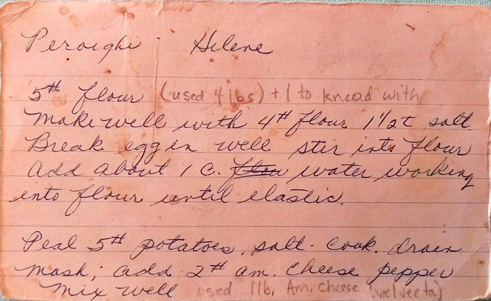
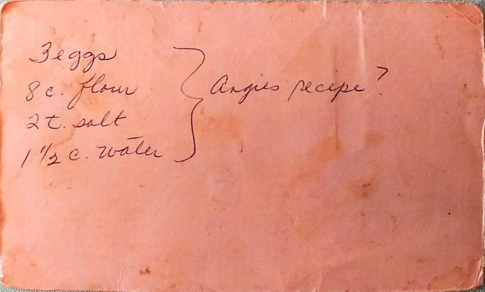

Peroighi
==========================================================

_This is a half batch, make around 70 peroighi_

Ingredients
--------------------------------------------

* 2.5 lbs. Potato
* 1/2 block of Velveeta Cheese ( or 1/4-1/2 lbs. America Cheese)
* 1 Onion, Chopped
* 16 oz. Sauerkraut
* 5 cup flour
* 1 Egg
* Salt and Pepper
* Lots of Butter (at least 2 boxes)

Directions
--------------------------------------------

### Potato Filling:
1. Peel, chunk, and boil potatoes.
2. While potatoes are cooking, chunk or grate the cheese
3. Mash the potatoes, mix in the cheese.
  * _Optional: Save some of the potato water_
4. Season with salt and pepper

### Sauerkraut Filling:
1. Salute onions in 1/2 stick of butter.
2. Add sauerkraut and salute until tender. If needed, add water the mixture to while cooking

### Dough:
1. Make a well in the flour
2. Salt the dough with 1 1/2 tsp of salt.
  * _Liz Livecchi:_ No exact amount, but salting the dough in three circles
3. Add egg to the well, mix in
4. Gradually add 1.5 cups of water while kneading.
5. If the potato water was saved, add a 1/4 cup of the cool potato water.
  * _Liz Livecchi:_ This makes the dough touch, skips adding the water
6. Dough should be smooth, elastically and quite firm. (It is more like a noodle dough then bread dough.) Add more or less water as needed.
7. Cover the dough with plastic wrap.
8. Roll out a chunk of dough (softball sized). Thickness varies by the dough, but an 1/8 inch is probably the max thickness.
9. Use a large mouth mason jar lib band to cut out circle of the rolled out dough.    Set and cover the dough scraps aside for later use. Use all fresh dough first, then combine the scraps to use again.
10. Place about 2 teaspoons (a large spoonful) of potato or sauerkraut filling in the center of each circle. Fold the dough over, stretching slightly to cover the potato. Press and seal the edges so there is no seam.
  * _Optional:_ Wipe half the edge of the dough with finger dip in water.
11. Cook seven peroighi at a time in boiling salted water. As soon as one rises to the surface, cook for 2 minutes longer. Place in plan with melted butter so they don't stick.
  * _Note:_ Change out water if/when it is become dirty
  *  _Note:_ Cooking time might be longer for first batch in new water
12. Transfer to bag after ever three batches. Add about four tablespoons of melted butter to the bag to keep the peroighi from sticking.
13. **Freeze:** Bags of peroighi can be refrigerated/frozen.
14. **Serving:** Can be served two by warming in  microwave or by frying in butter utill browned.

Pictures
----------------------------------------------------

Notes
---------------------------------------------------------
* Originally From Helene, Don Smerklo's mother
* Made at Easter
