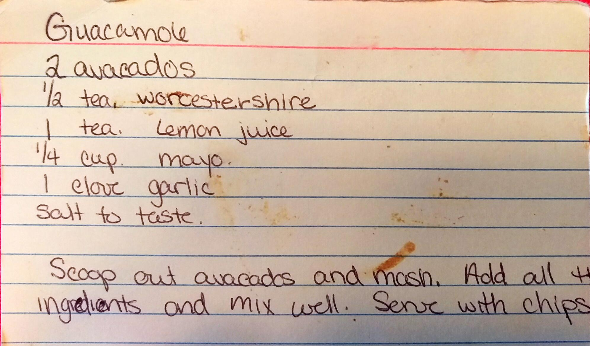

Guacamole
========================================================

Ingredient
----------------------------------------------------------
* 2 avacados
* 1/2 tsp. worcestershire
* 1 tsp. lemon juice
* 1/4 cup mayo
* 1 clove garlic
* salt to taste
* chips

Directions
------------------------------------
1. Scope out the avacados and mash
2. Add all the ogredients and mix well. 
3. Serve with chips

Pictures
-------------------------------------------------

Notes:
--------------------------------
* Also known as a dutch baby
